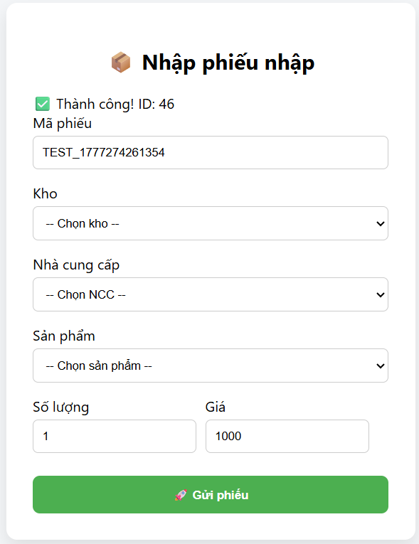
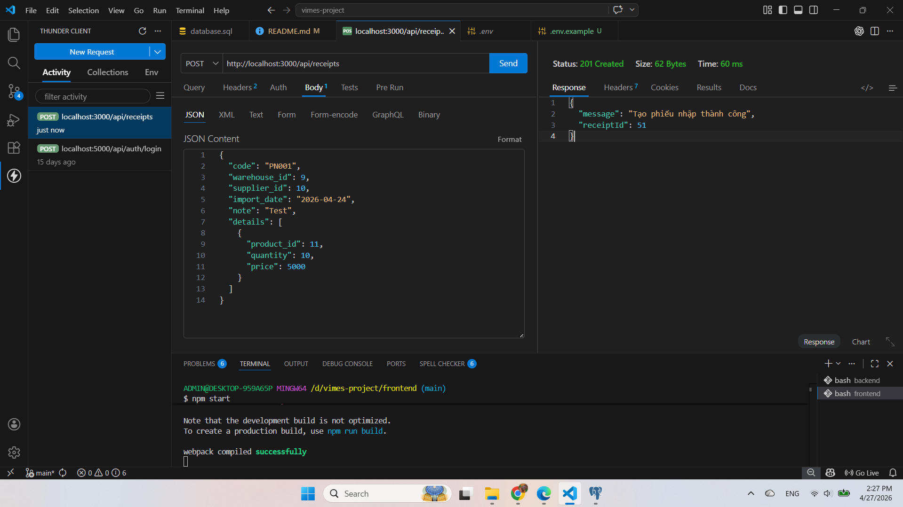

# 📦 VIMES - Warehouse Management System (Mini)

## 📌 Giới thiệu

Đây là project fullstack sử dụng:

- Backend: Node.js + Express + TypeScript
- Frontend: React
- Database: PostgreSQL
- Testing: Jest

Chức năng chính:

- Tạo phiếu nhập kho
- Lưu dữ liệu vào database
- Cập nhật tồn kho
- Có unit test API

---

## ⚙️ Cài đặt

### 1. Clone project

```bash
git clone https://github.com/LuuTheTaiBean/vimes-project.git
cd vimes-project
```

---

### 2. Setup Backend

```bash
cd backend
npm install
npm run dev
```

👉 Server chạy tại:

```
http://localhost:3000
```

---

### 3. Setup Frontend

```bash
cd frontend
npm install
npm start
```

👉 UI chạy tại:

```
http://localhost:3001
```

---

## 🗄️ Database

### Tạo database:

```sql
CREATE DATABASE vimes_db;
```

### Import dữ liệu:

- Mở pgAdmin
- Chạy file: `database.sql`

---

## 🔌 API

### Tạo phiếu nhập

```
POST /api/receipts
```

### Body mẫu:

```json
{
  "code": "TEST_123",
  "warehouse_id": 1,
  "supplier_id": 1,
  "import_date": "2026-04-24",
  "note": "Test",
  "details": [
    {
      "product_id": 1,
      "quantity": 5,
      "price": 1000
    }
  ]
}
```

---

## 🧪 Test

Chạy test:

```bash
cd backend
npm test
```

---

## 📸 Demo

### Giao diện



### API test



## 📁 Cấu trúc project

```
vimes-project
│
├── backend
│   ├── src
│   │   ├── config
│   │   ├── controllers
│   │   ├── routes
│   │   ├── tests
│   │   ├── app.ts
│   │   └── index.ts
│
├── frontend
│   ├── src
│   └── public
│
├── database.sql
└── README.md
```

---

## 🚀 Tính năng đã hoàn thành

- ✅ Thiết kế database (PostgreSQL)
- ✅ API nhập kho (Express + TypeScript)
- ✅ Giao diện nhập liệu (React)
- ✅ Kết nối frontend - backend
- ✅ Unit test (Jest)

---

## 📌 Ghi chú

- Project demo cho mục đích học tập / tuyển dụng
- Có thể mở rộng thêm:
  - CRUD sản phẩm
  - Quản lý tồn kho nâng cao
  - Authentication

---

## 👨‍💻 Tác giả

- Name: (Luu The Tai)
- Email: (luuthetai616@gmail.com)
